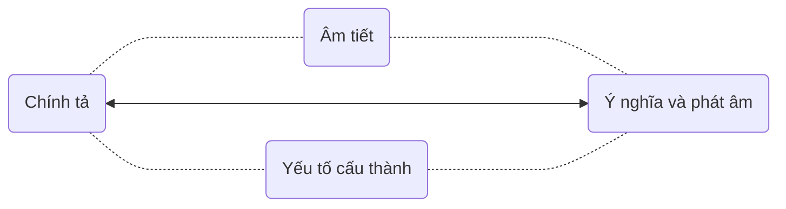
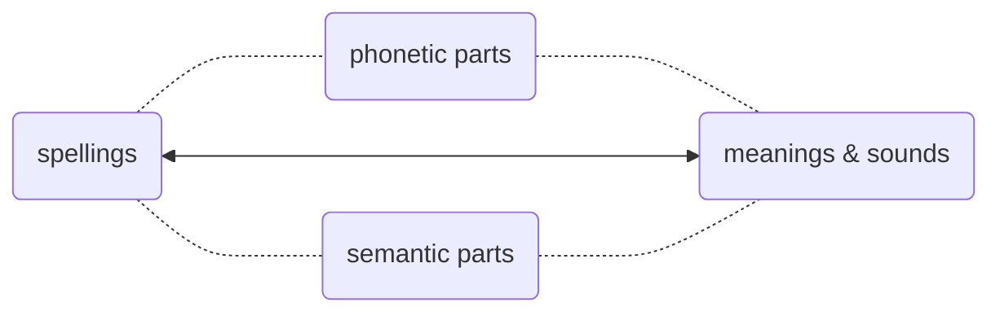
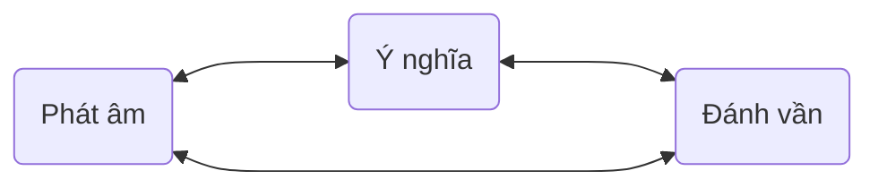
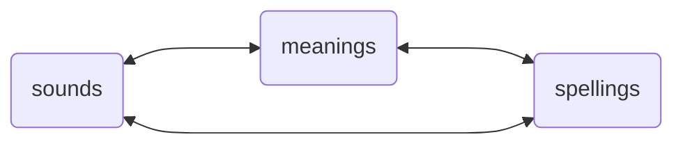

# 4. Và sau đó (What's next)

Ngữ âm có thể được hoàn thiện hoàn toàn trong khoảng 3 đến 6 tháng đào tạo chuyên sâu — ít nhất có thể đạt được sự cải thiện đáng kể. Vậy bước tiếp theo là gì? Bước tiếp theo là giải quyết khía cạnh khác của ngôn ngữ, đó là văn bản ngoài ngữ âm — bất kỳ ngôn ngữ nào cũng đều là sự kết hợp của ngữ âm và văn bản.

With 3 to 6 months of intensive practice, you can really nail pronunciation — at least, you can see huge improvements. So, what's next? The next step is to master the other side of the language: the written word. Every language boils down to a combination of speaking and writing.

Yếu tố cơ bản nhất của văn bản là từ vựng. Từ vựng tiếng Anh cơ bản là “chữ cái âm tiết”. Viết chính tả tiếng Anh, nếu sử dụng khái niệm tiếng Trung, có hai loại: một loại “biểu âm” và một loại “biểu ý” — hoặc “vừa biểu âm vừa biểu ý”.

The most basic element of writing is vocabulary. English words are fundamentally "phonetic script." If we borrow concepts from Chinese, English spelling falls into two categories: one is "phonetic," the other is "semantic" — or sometimes "both phonetic and semantic."

Ví dụ, _apple_ ˈæp.əl  là một từ có cấu trúc biểu âm, gồm hai âm tiết, _app_ tương ứng với âm tiết đầu tiên ˈæp, và _le_ tương ứng với âm tiết thứ hai əl. Vì vậy, khi ghi nhớ từ này, không phải là nhớ từng chữ cái một, như “a, p, p, l, e… _apple!_”. Mà là: æ tương ứng với _a_; _app_, p được viết là hai chữ _pp_, sau đó là le tương ứng với əl — kiểu viết này rất phổ biến, ví dụ như _double_ ˈdʌb.əl , _impossible_ ɪmˈpɑː.sə.bəl …

For example, _apple_ ˈæp.əl  is _phonetic_ and has two syllables. The first syllable is _app_ ˈæp, and the second syllable is _le_ əl. So, when you’re memorizing it, you don’t go letter by letter saying, "a, p, p, l, e... _apple!_". Instead, think of it like this: æ matches with _a_; _app_ includes p spelled as double _pp_, and then le matches with əl. This spelling pattern is quite common, for example, in words like _double_ ˈdʌb.əl  and _impossible_ ɪmˈpɑː.sə.bəl .

Ngoài ra, trong từ vựng thông dụng có rất nhiều từ là “từ ghép” (_compound words_), mỗi phần của chúng cũng đều mang ý nghĩa. Ví dụ như _classroom_ ˈklæs.ruːm , _doorbell_ ˈdɔːr.bel , _handwriting_ ˈhændˌraɪ.t̬ɪŋ , _sunshine_ ˈsʌn.ʃaɪn , _upstairs_ ʌpˈsterz , v.v.

Besides, there are quite a few common words that are actually compound words, with each part contributing to the overall meaning, that is, they are _semantic_. For example, _classroom_ ˈklæs.ruːm , _doorbell_ ˈdɔːr.bel , _handwriting_ ˈhændˌraɪ.t̬ɪŋ , _sunshine_ ˈsʌn.ʃaɪn , _upstairs_ ʌpˈsterz , and so on.

Các gốc từ và tiền tố, hậu tố, đặc biệt là những cái đến từ tiếng Latinh, thực sự không có nhiều ứng dụng trước khi vốn từ vựng đạt đến một mức nhất định — nhưng khi đạt đến một mức độ nhất định, ví dụ như khi vốn từ vựng vượt quá 5.000 từ, việc nghiên cứu các gốc từ và tiền tố sẽ rất hữu ích cho việc mở rộng từ vựng một cách nhanh chóng và hiệu quả.

Roots and affixes, especially those from Latin, aren’t very useful until your vocabulary reaches a certain level. But once you get to around 5,000 words, having a solid foundation, delving into roots and affixes can really help you expand your vocabulary quickly and significantly.

Lấy một ví dụ, _ichthyosaur_ ˈɪk.θi.ə.sɔːr , từ này rõ ràng không phải là từ thường dùng, nhưng thực ra rất đơn giản, đầu tiên hãy nhìn vào cấu tạo âm tiết, ˈɪk.θi.ə.sɔːr —— Từ điển Cambridge phân chia nó thành 4 âm tiết… nhưng cảm giác, âm tiết thứ hai và thứ ba có thể gộp lại, ˈɪk.θiə.sɔːr, _ich_ ⭤ ˈɪk, _thyo_ ⭤ θiə, _saur_ ⭤ sɔːr… Còn từ góc độ ý nghĩa thì sao? Phần đầu _ichthyo-_ có nghĩa là “liên quan đến cá”… Phần sau _-saur_ có ý nghĩa gì? Các loại khủng long đều kết thúc bằng “-saur”, vì vậy, từ này có nghĩa là “cá khủng long”… Nói cách khác, hai phần của từ này đều là gốc từ Latin và tiền tố, đều là “vừa biểu âm vừa biểu nghĩa”, thực ra rất đơn giản —— mặc dù cách viết có vẻ phức tạp.

Take _ichthyosaur_ for example: ˈɪk.θi.ə.sɔːr . At a glance, you can tell it's not a common word. But it's actually quite simple. Let’s break it down by its sounds. The Cambridge Dictionary splits it into four syllables: ˈɪk.θi.ə.sɔːr. However, the second and third syllables feel like they can be combined: ˈɪk.θiə.sɔːr. So, _ich_ is ˈɪk, _thyo_ is θiə, and _saur_ is sɔːr. From a _semantic_ perspective, the first part, _ichthyo-_, means "related to fish." The second part, _-saur_, means "lizard" or "reptile," like in many dinosaur names that end in _-saur_. So, the word _ichthyosaur_ means "_fish lizard_" or "_fish reptile_." In other words, this word's parts, drawn from Latin roots and suffixes, make it both _phonetically_ and _semantically_ simple, even if its spelling looks complicated at first glance.

Cách đơn giản và hiệu quả nhất để ghi nhớ từ vựng là liên kết cách viết, phát âm và nghĩa của nó — đây vốn dĩ là cấu trúc và ý nghĩa của chữ viết.

The simplest and most effective way to remember vocabulary is to connect its spelling, pronunciation, and meaning. This is essentially the structure and purpose of words.

Vì vậy, khi học từ vựng, bạn nên vừa nói vừa viết, khi đã nói ra thì có thể nghe được, khi đã viết ra thì có thể nhìn thấy — đây nên là một hoạt động kích thích nhiều giác quan cùng lúc.

When you're building vocabulary, you should say and write the words at the same time. If you speak it, you hear it. If you write it, you see it. It should be an activity that engages multiple senses at once.

Ngoài ra, mọi phương pháp khác được gọi là “phương pháp” đều không chỉ không hiệu quả, mà thậm chí còn có tác dụng phụ, hại nhiều hơn lợi. Ví dụ như “phương pháp ghi nhớ qua âm thanh” hoặc “phương pháp ghi nhớ thú vị”, chúng đều đi ngược lại cơ chế làm việc cơ bản của não bộ đối với ngôn ngữ và chữ viết, không thể cải thiện hiệu quả, chỉ làm tăng gánh nặng không cần thiết — mặc dù đôi khi có cảm giác thú vị.

Apart from this approach, any other so-called "method" is not only ineffective but also counterproductive. Techniques like "homonym mnemonics" or "fun memory tricks" go against how the brain naturally processes language, speaking or writing. They don't improve efficiency; they just add unnecessary work, even if they sometimes seem somewhat amusing.

Nguyên nhân thất bại của mọi người rất đơn giản, họ luôn muốn “tiết kiệm công sức hơn một chút”. Ngồi đó chỉ dùng mắt nhìn, không động đến miệng và tay, do đó thực tế là động não cũng ít hơn. Việc chỉ sử dụng một cơ quan và việc kích hoạt nhiều cơ quan cùng lúc là khác nhau, cái trước có vẻ tiết kiệm công sức hơn, nhưng thực tế do ít sử dụng não bộ, kết quả là “hiệu quả gần như bằng không”.

The reason people fail is simple: they want to take the easy way out. They just sit there looking at words with their eyes, without speaking or writing, which means they engage their brains less. Using just one sense is not the same as using multiple senses simultaneously. The former might seem easier, but due to minimal brain engagement, the results are almost negligible.

Người học ngoại ngữ thường thất bại. Nhiều người đã thất bại từng hỏi giáo viên, “Thưa thầy, nếu tôi học từ vựng mà không nhớ cách phát âm thì có được không?” “Thưa thầy, nếu tôi học từ vựng mà không nhớ cách viết thì có được không?” Những câu hỏi vô lý như vậy không phải để tìm kiếm câu trả lời, mà chỉ là để tìm một “giấy phép lười biếng”, để biện minh cho sự lười biếng của bản thân… Thật không ngờ, có thật nhiều giáo viên trả lời “Có thể!” Vì thực tế có một tỷ lệ giáo viên đáng kể sử dụng phương pháp này để nhận được nhiều thiện cảm từ học sinh, từ đó tăng thu nhập của mình…

Most people fail at learning a new language. Many of them have asked their teachers, "Can I memorize words without learning their pronunciation?" or "Can I memorize words without learning how to spell them?" These absurd questions aren't looking for real answers; they are just seeking a justification to cut corners. And believe it or not, some teachers say "yes" to gain popularity and, as a result, increase their income.

Việc mở rộng từ vựng là một quá trình có “tăng tốc” — có thể ngày càng nhanh hơn… Tuy nhiên, ở giai đoạn đầu, tốc độ rất thấp, gia tốc bằng không, vì vậy thường cảm thấy cực kỳ khó khăn. Tuy nhiên, từ vựng có liên quan với nhau, đối với não bộ, một từ mới càng liên kết nhiều với từ vựng đã biết, thì càng dễ nhớ. Nói cách khác, lượng từ vựng đã có càng nhiều, từ mới có thể tạo ra nhiều liên kết hơn với chúng, vì vậy càng dễ nhớ hơn. Khi lượng từ vựng của bạn vượt quá ba, năm nghìn từ, bạn sẽ cảm thấy nhiều từ mới gần như chỉ cần nhìn qua một lần là nhớ được, dù là cách viết, phát âm, ý nghĩa hay cách sử dụng của chúng.

Building your vocabulary has a snowball effect—you can pick up speed as you go. However, at the beginning, the speed is very low, and it feels incredibly hard. Words are interconnected. For your brain, the more links a new word has with the words you already know, the easier it is to remember. So, the larger your vocabulary, the more connections there are, and it becomes increasingly easier to learn new words. When your vocabulary exceeds three to five thousand words, you'll find that you can almost remember new words at a glance, including their spelling, pronunciation, meaning, and even usage.

Vì vậy có một mẹo. **Học thuộc câu ví dụ trực tiếp**… Đối với não bộ, “đọc nhiều lần câu ví dụ” dễ hơn nhiều so với “dành toàn bộ sức lực cho một từ hoặc cụm từ”. Trong việc học ngôn ngữ là như vậy, bạn làm nhiều hơn, đối với não bộ sẽ càng dễ dàng hơn; ngược lại, bạn làm ít hơn, sự “tiết kiệm công sức” dần dần hình thành sẽ chỉ là một trở ngại không thể vượt qua đối với não bộ.

Here's a tip: _memorize **sentences** directly_. For your brain, reading a few example sentences repeatedly is much easier than focusing all your effort on a single word or phrase. In language learning, the more you do, the easier it gets for your brain. Conversely, the less you do, the so-called "easier way" forms an insurmountable obstacle.

Tiếp theo, phương pháp mở rộng từ vựng đáng tin cậy nhất là: **đọc kỹ**. Tìm những cuốn sách mà bạn thực sự quan tâm (bao gồm cả tiểu thuyết và sách không phải tiểu thuyết), khi gặp từ mới thì tra cứu, loại bỏ từng từ một — đọc mỗi cuốn sách nhiều lần (vì vậy phải chọn những cuốn sách mà bạn thực sự mê mẩn)… Khi đọc đi đọc lại, từ vựng của bạn sẽ tăng lên, rào cản cú pháp sẽ biến mất, khả năng hiểu biết sẽ được cải thiện, và tốc độ đọc sẽ nhanh chóng tăng lên… Các ngôn ngữ đều như vậy. Ngay cả đối với ngôn ngữ mẹ đẻ của chúng ta, khả năng nắm vững ngôn ngữ mẹ đẻ cũng được luyện tập theo cách này — các lớp học ngữ văn ở trường và giáo viên ngữ văn không bao giờ giúp đỡ được gì… Nói một cách cay nghiệt, vai trò duy nhất của các giáo viên ngữ văn là tạo ra những rào cản kỳ lạ cho hầu hết học sinh trong các kỳ thi.

The most reliable method to expand your vocabulary is _intensive reading_. Find books you are genuinely interested in (both fiction and non-fiction). Look up unfamiliar words and eliminate them one by one. Read each book several times, so make sure you really love these books. As you read, your vocabulary will grow, syntax barriers will disappear, your comprehension will improve, and your reading speed will soar. This applies to all languages. Even in our native language, our proficiency comes from practice—not from schools or language teachers. In fact, these teachers often only serve to create odd obstacles in exams.
