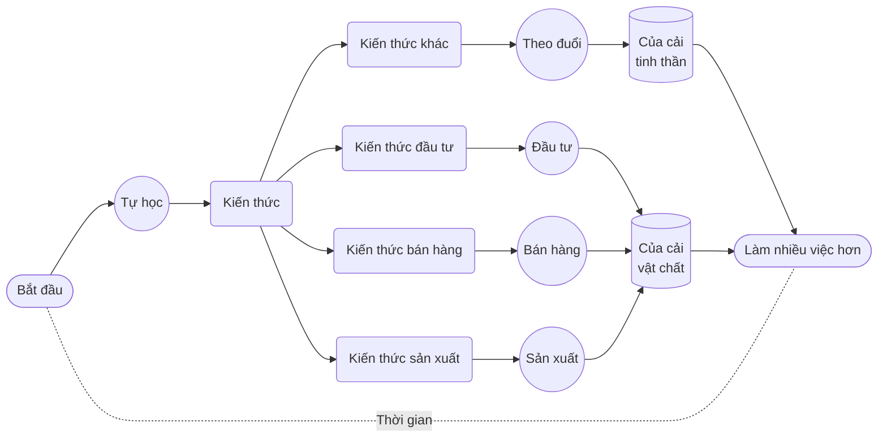

# 1. Dùng Binh Ra Trận

Mọi người sẵn sàng chi tiền cho giáo dục… nhưng tiếc là họ thường không muốn đầu tư sự chú ý — tiếng Anh có cách diễn đạt rất chính xác cho điều này: **pay attention to something**, nghĩa là “trả sự chú ý cho cái gì đó”.

Chúng ta thường có ba nguồn lực: **tiền bạc**, **thời gian**, và **sự chú ý**. Bản chất của giáo dục chính là **đầu tư vào bản thân**. Mọi hình thức đầu tư trên đời đều giống nhau, đều cần thời gian làm tư liệu sản xuất cơ bản. Nếu không bỏ thời gian, hoặc chỉ đầu tư rất ít thời gian thì đó không phải là **đầu tư** mà là **đầu cơ**.

Khi đầu tư, về căn bản ta đều làm một việc: **đổ tiền vào thời gian**. Nếu áp dụng chiến lược đầu tư định kỳ, tức là không ngừng đổ tiền vào theo thời gian nhưng tuyệt đối không đầu tư sự chú ý. Khi chúng ta học, tức là khi đầu tư vào bản thân, có một điểm khác biệt quan trọng: bên cạnh việc đổ tiền vào thời gian, điều cần thiết hơn chính là đổ **sự chú ý**.

Nhìn theo góc độ này, nguyên nhân chính của mọi thất bại trong học tập không ngoài hai kiểu sau đây:

> - Chi tiền mà không bỏ thời gian
> - Bỏ thời gian mà không chú ý

Cuối cùng thì mọi thất bại đều chỉ vì **không đầu tư đủ sự chú ý vào thời gian**.

Mọi người thường nhầm tưởng rằng IQ quyết định thành bại học tập, và IQ là thứ bất biến. Thực ra cả hai quan điểm đó đều dựa trên những hiểu lầm.

Yếu tố quyết định thật sự chính là **sự chú ý**.

Tôi có một cách nói ví von dễ hình dung: nếu một người có thể tập trung chú ý liên tục khoảng 25 phút, người đó tương đương một **vị tướng**, có **binh lính để điều khiển**. Mỗi lần tập trung 25 phút như vậy, tương đương một binh lính. Nếu một người có thể nhiều lần trong ngày tập trung 25 phút liên tục, tức là vị tướng đó có nhiều binh lính để dùng.

Binh càng nhiều, dĩ nhiên càng tốt. Nhưng thời gian trong ngày có hạn, đồng thời để duy trì sự chú ý não bộ cần tiêu hao nhiều năng lượng, nên binh không thể vô tận. Tuy nhiên, với phần lớn người bình thường, chỉ cần có bảy tám binh trong ngày là đủ làm được nhiều việc. Nếu duy trì được điều này lâu dài, chắc chắn sẽ đạt được thành tựu rất ấn tượng.

Sau khi đã **có binh để dùng**, cần phải **có trận để đánh**. Nuôi binh nhờ đánh trận. Nếu không có trận để đánh, binh lính sẽ dần phế hoá. Chỉ khi liên tục chiến đấu, binh mới ngày càng mạnh hơn. Cụ thể là từ khả năng tập trung 25 phút, sẽ phát triển thành 30, 40 phút thậm chí lâu hơn. Binh mạnh tất nhiên càng tốt. Binh càng mạnh thì dùng ít binh cũng đánh được những trận lớn.

Dùng **binh mạnh** đánh **trận nào**? Học tập chính là đánh trận bằng binh, tự học là tự mình dùng binh ra trận… Đại đa số thời gian trong đời ta nên dành cho việc **tự học**. Học gì? Học kiến thức sản xuất, học kiến thức bán hàng, học kiến thức đầu tư — để tạo ra của cải vật chất, sau đó còn học nhiều kiến thức khác — để theo đuổi của cải tinh thần, rồi mới có thời gian làm nhiều việc khác.

Đáng tiếc là phần lớn người **không có binh để dùng**, họ không thể tập trung chú ý liên tục 25 phút. Vì thế họ cũng không phải vị tướng trong ví von này. Họ **không có trận để đánh**, nên cũng không nuôi được binh… Điều này không liên quan IQ hay tài năng thiên bẩm, có binh mà không có trận để đánh cũng vô ích, và binh sẽ bị phế hoá theo thời gian… Đành rằng thông minh đến mấy cũng không giúp gì.

Bạn đoán điều đáng tiếc nhất là gì?

> **Mỗi người vốn dĩ đều có binh lính, và đều là binh mạnh.**

Trẻ con có khả năng tập trung rất lâu, chỉ cần không bị quấy rối, chúng dễ dàng bị thu hút bởi thứ gì đó để rồi tập trung không rời, trừ khi đói bụng.

Phụ huynh thường không hiểu cần nâng niu sự chú ý của con mình — dù con làm gì, họ có thể lúc nào cũng xông tới ôm hôn, thỏa mãn bản thân. Trường học cũng có thể là thủ phạm phá vỡ sự chú ý của phần lớn trẻ, dù không phải cố ý — ngồi hàng chục phút trong lớp học chán ngấy, nhiều trẻ không học được cách tập trung mà chỉ học cách ngồi đó mà mơ màng nhưng không bị phát hiện. Nền kinh tế hàng hoá đã tiến hóa thành kinh tế chú ý, cả thế giới đang tranh giành sự chú ý của chúng ta. Trong 10-15 năm gần đây, thiết bị di động thông minh đã đè nén phạm vi chú ý trung bình của phần lớn mọi người trên hành tinh xuống dưới 2 phút.

Vì thế, hầu hết mọi người dần trở thành những kẻ **không có binh để dùng**, không có trận để đánh — nhưng vô cùng đáng tiếc là họ vốn sinh ra đã là những vị tướng mạnh với binh mạnh.

Trí thông minh thể hiện ra bên ngoài thực ra là kết quả tích luỹ — không chỉ thông minh, mà cả cái gọi là tài năng thiên bẩm cũng vậy, nếu nó thực sự tồn tại.

Ngày xưa người ta nghĩ **quãng âm chuẩn** (Perfect Pitch) là một tài năng trời cho, có hay không có, người trong hàng trăm ngàn thậm chí hàng vạn người mới có một, như Mozart — ông có thể nhận biết bất cứ âm cao nào, kể cả tiếng ho khan từ phòng khác, đều dùng phím đàn chơi lại chính xác tông đó.

Nhưng sau này các nhà nghiên cứu phát hiện ra cái gọi là tài năng ấy thực chất là kết quả của **luyện tập**, không có ngoại lệ — bí quyết luyện thành công chỉ đơn giản là **luyện lâu**… Với những người được gọi là thiên tài, lợi thế thật sự của họ chỉ là **bắt đầu luyện sớm**, nên **luyện lâu hơn**… Nghiên cứu của ngày càng nhiều nhà khoa học thần kinh xác nhận điều này: mỗi người sinh ra có thể có **tiềm năng** tương đương, nhưng tiềm năng ấy phải được **rèn luyện** để được **hiện thực hoá**… Nói cách khác, không phải ai cũng không có tài năng, mà là nhiều người bỏ phí thời gian nên đánh mất cơ hội để phát triển tài năng.

Luyện quãng âm chuẩn không khó, không phức tạp, trên mạng còn có nhiều phần mềm mã nguồn mở miễn phí. Tỷ lệ người có quãng âm chuẩn trong xã hội nay không còn là một phần trăm hay một phần vạn nữa — đã vượt qua 1% và vẫn tăng lên từng ngày. Vô số ví dụ chứng minh ai cũng có thể học được quãng âm chuẩn nếu luyện tập đủ dày đặc và đủ lâu, bắt đầu ở bất kỳ độ tuổi nào cũng được — vì đây không phải cái gì “có thì có, không có thì không” mà là thứ chỉ có được khi **luyện tập, không luyện thì không có**.

Dĩ nhiên con người có khác biệt, nên cái gọi là **tài năng** còn hàm chứa ý nghĩa về các khác biệt sinh lý không tránh khỏi. Ví dụ: ngón tay ngắn sẽ bất lợi khi đánh đàn, người thấp không lợi thế chơi bóng rổ, người đẹp có thể dễ giao tiếp hơn, người có quãng âm chuẩn học tiếng ngoại ngữ đặc biệt luyện phát âm sẽ có lợi hơn… Đây là những thực tế khó phủ nhận. Nhưng đồng thời ta luôn thấy những ví dụ ngược lại: danh cầm ngón tay ngắn không hiếm, cầu thủ bóng rổ nhỏ con cũng không ít, chuyên gia đàm phán kém sắc mà thành công rất nhiều…

Học là học. Luyện là luyện. Bạn vốn là vị tướng, đúng là một vị tướng. Bạn phải dẫn binh đánh trận.

Một trận thắng nối tiếp trận thắng, không chỉ tích luỹ thành tích, mà còn có ngày càng nhiều binh lính mạnh hơn, cùng kinh nghiệm điều binh khiển tướng. Như thế thì năng lực mạnh nhất một người có được chính là **khả năng điều động và chỉ huy sự chú ý**. Khi đã sở hữu năng lực này, bạn có binh để dùng, có trận để đánh, sẽ không gì cản nổi, thành công tất có — dĩ nhiên không liên quan gì IQ hay tài năng thiên bẩm… Nếu có liên quan chắc là do người ta nhầm lẫn khả năng đó là thông minh hoặc tài năng.

Hãy **đổi cách nghĩ đi!**

> Dù tài năng có thật, cũng như IQ, đều là thứ **rèn luyện mà thành**, là thứ **tích luỹ mà được** chứ không phải thứ lắp đặt sẵn hay sinh ra đã có sẵn trong người.

Đổi cách nhìn này rất có lợi, bởi nó tựa như “thay não” một cách nhẹ nhàng và nhanh chóng — còn hơn là thay đổi cuộc đời.

Dưới đây là cách trình bày có thể chính xác và hiệu quả hơn:

> - Bạn có tiềm năng vô hạn;
> - Tiềm năng của bạn có được hiện thực hay không, phụ thuộc bạn có rèn luyện hay không, luyện mấy lâu, bắt đầu sớm hay muộn, luyện có quyết liệt hay không;
> - Bạn có thể hiện thực hoá bao nhiêu tiềm năng phụ thuộc vào bạn có bao nhiêu thời gian;
> - Thời gian của bạn có hiệu quả hay không phụ thuộc bạn đầu tư bao nhiêu sự chú ý.

Lý do để học thì vô vàn. Nhưng nhìn từ góc độ này thì đơn giản, rõ ràng: chúng ta phải **đầu tư binh mạnh để thành tướng giỏi**, không thì thật đáng sợ! Dùng thời gian của chúng ta để điều binh ra trận, không có trận thì tìm trận mà đánh. Cuộc sống là chiến đấu không ngừng, ta đạt được bao nhiêu tiềm năng thì sẽ đạt bấy nhiêu.
