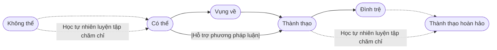
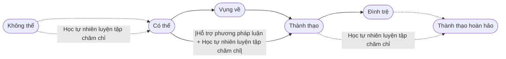

# 3. Học Tự Nhiên và Luyện Tập Chăm Chỉ

Dù làm việc gì, não bộ cũng phải điều phối nhiều cơ quan để thực hiện. Nó không chỉ điều phối các cơ quan bên ngoài não mà còn phối hợp nhiều vùng bên trong não. Những phần này tương tự như vô số **mạng nội bộ cục bộ** liên kết hoạt động với nhau…

Những mạng nội bộ này được xây dựng dần theo thời gian — mỗi mạng được thiết lập qua quá trình học tập và củng cố nhờ lặp đi lặp lại nhiều lần. Dù chúng ta định học gì, bước đầu tiên luôn là tập trung chú ý quan sát — kích hoạt mọi giác quan cần thiết như thị giác, thính giác, xúc giác — rồi mới bắt đầu thử làm…

Quy trình này gần như luôn giống nhau: khi bắt đầu **thử nghiệm**, điều đầu tiên gặp phải chắc chắn là **không thể làm được**, phải trải qua **lặp lại nhiều lần thử**, rồi mới có thể có **khả năng làm được**, sau khả năng là cảm giác **vụng về**, rồi từng bước chuyển sang **thành thạo**, tiếp theo là giai đoạn **đình trệ** kéo dài, sau cùng mới có thể đạt đến bậc **thành thạo hoàn hảo** (thông thạo).

Điều khó nhất và cũng quan trọng nhất trong quá trình này chính là bước **vượt từ không thể sang có thể** — đó là bước đột phá từ con số 0 lên 1.

Khó khăn cốt yếu trước hết là do **khả năng quan sát của chúng ta không bao giờ đủ hoàn chỉnh**. Ví dụ, một trong những ngôn ngữ mẹ đẻ của tôi là tiếng Triều Tiên, nên tôi phát âm được âm rung đầu lưỡi (voiced alveolar trill). Tôi có một đứa cháu nhỏ tên là Đô Đô, khi chơi đùa thường gọi tên cháu bằng âm rung đầu lưỡi đó:

<audio controls><source src="/audios/dudu.mp3">Trình duyệt của bạn không hỗ trợ đoạn âm thanh này.</source></audio>

Chúng rất thích thú và cũng muốn phát âm giống như vậy. Nhưng suốt thời gian dài, chúng không thể làm được. Lũ trẻ cố thử nhiều lần nhưng không thành công. Chúng tạo ra âm rung dùng môi, nhưng chính bản thân chúng biết đó không phải âm âm lưỡi mà chúng nghe. Chúng tiếp tục thử đủ cách nhưng vẫn không thể.

Việc khó khăn chủ yếu là do chúng không thể quan sát được lưỡi tôi rung thế nào ở phần răng lợi — đó là nguyên nhân gây ra khó khăn do không có quan sát đầy đủ. Thêm nữa, tôi cũng không giải thích rõ làm sao để làm được điều đó, tôi thường nghĩ mình sinh ra đã làm được... Nhưng thật ra thì không. Tôi ban đầu cũng như bọn trẻ, nhiều lần thử mới phát được âm đó, rồi quên mất bản thân cần luyện bao lâu để đạt được — lầm tưởng đó là năng lực thiên phú.

May mắn là Wikipedia có giải thích đầy đủ, hệ thống về âm rung này — có bản dịch sang 37 thứ tiếng, trong đó tiếng Anh gọi là [Voiced alveolar trill](https://en.wikipedia.org/wiki/Voiced_dental,_alveolar_and_postalveolar_trills), tiếng Trung là [齿龈颤音](https://zh.wikipedia.org/?curid=274842)… Không chỉ có văn bản chi tiết mà còn có video minh hoạ slow motion:

<video controls width="480"> <source src="/videos/voiced-alveolar-trill.mp4" type="video/mp4"></source>Trình duyệt của bạn không hỗ trợ video này.</video>

Giờ đây, không chỉ có quan sát đầy đủ, mà phương pháp cũng rất hệ thống… Thế nhưng xem xong video liệu làm được ngay? Rõ ràng chưa chắc. Trong não chưa có mạng chức năng tương ứng để điều phối — cần phải xây dựng mới hoàn toàn. Và không chỉ một hay hai, dù đây chỉ là động tác nhỏ, thực tế cần phối hợp mạng chức năng rất phức tạp. Việc xây dựng mạng kết nối mới cần thời gian, dù quan sát chưa hoàn chỉnh hay có phương pháp, thời gian vẫn không thể né tránh.

Vậy làm sao để **đột phá**?

Thời tôi còn bé, phim truyền hình Hồng Kông rất hot ở Trung Quốc, lúc đó xem phim ít nên cả nước đều xem một bộ phim… Trong một bộ phim võ hiệp, có một cảnh quay cận thận cảnh một cao thủ võ lâm mà mọi người chú ý là tai anh ta cử động! Ngày hôm sau, cả lớp hỏi nhau: Bạn có thể cử động tai không? Mọi người đều không thể… Trước đó ai cũng chưa từng cử động tai hay nghĩ đến chuyện đó. Mấy ngày sau có một bạn nói cậu ta làm được, mọi người tới xem và kinh ngạc… Vài ngày tiếp theo, nhiều bạn trong lớp cũng học được cử động tai… Dĩ nhiên, không ai giải thích nổi **phương pháp cử động tai**, câu trả lời đều là: “Cứ thử đi là được”.

Chính là như vậy — **Cứ thử đi là được**.

Ở Tân Cương, trẻ em từ nhỏ đều được **học lắc cổ**, đó là cử động hiếm gặp trong các dân tộc khác. Hỏi họ cách lắc cổ thế nào, chẳng ai nói rõ, thậm chí có người mô tả cụ thể thì bạn cũng không thể học được… Liệu có thật là không thể học? Dĩ nhiên là học được, còn về mặt **phương pháp** thì không phải không quan trọng mà chỉ là chưa được đánh giá cao.

Rất ít người có thể **cử động đầu mũi**, trong đời chẳng ai cần làm thế… Nhưng diễn viên chính trong hai phiên bản phim “Gia Hữu Tiên Tỷ” dù là Elizabeth Montgomery trong bản truyền hình hay Nicole Kidman trong bản điện ảnh đều học được — học thế nào? Cũng là **“cứ thử đi là được”**.

Chìa khoá để đột phá là **thử liên tục**, cách này không được thì thử cách khác. Dù sao xây dựng kết nối mới, mạng lưới mới vẫn cần thời gian. Dùng gì để lấp đầy thời gian đó? Thử sai — đây là chiến lược tiến hóa duy nhất mà thiên nhiên ban tặng. Vậy vì sao chúng ta có thể liên tục thử? Vì ta **chắc chắn có khả năng** — người khác làm được, mình cũng làm được…

Đó là cách học dữ dội nhất trong đời, tôi gọi là **học tự nhiên luyện tập chăm chỉ** (生学硬练) — thử sai không ngừng cho tới khi có thể, luyện tập không ngừng cho đến khi thành thục:

> Vì chắc chắn có thể nên mới dám thử liên tục; thất bại là bình thường, chuyển cách rồi tiếp tục thử, cho tới khi thành công.

Mọi việc học đối với não bộ đều vậy, đột phá đầu tiên từ 0 thành 1 không thể dựa vào phương pháp luận mà chỉ có cách học tự nhiên luyện tập chăm chỉ mới vượt qua… Khi đã vượt bước đó, biến không thể thành có thể, quá trình từ vụng về đến thành thạo mới có cơ hội dùng đến phương pháp luận.

Nhưng vấn đề là, phương pháp luận dù có hữu ích, thường không thể hoạt động độc lập. Ví dụ, tôi nói với bạn âm ŋ khi đi kèm với nguyên âm thì sẽ biến thành n (xem [2.2.13.](../sounds-of-american-english/2.2.13-mnŋ)) — bạn hiển nhiên có thể hiểu ngay và nhớ kỹ, nhưng lần sau khi nói, bạn có thể làm được không? Đa phần là không. Rất nhiều kiến thức ngữ pháp tiếng Anh cũng như vậy đối với người học thứ hai, ở phòng thi họ làm bài đúng, nhưng khi mở miệng nói hay viết là mắc lỗi liên tục, dù họ có thể nhận ra lỗi ngay khi mắc.

Nhiều kiến thức và kỹ năng quan trọng là vậy: biết thôi chưa đủ, dù thành thạo cũng chưa đủ, phải thật sự tinh thông mới xứng đáng — bởi vì phải đạt đến trình độ có thể làm đúng một cách vô thức, tự nhiên. Trong não phải xây dựng thêm kết nối và mạng lưới mới cho cái gọi là “biết”, rồi tiếp tục củng cố đến mức có thể xử lý vô thức những tình huống đó — thành thạo chỉ giảm bớt gánh nặng phần nào, điều này đòi hỏi lặp lại vô số lần, tốt nhất là tập với cường độ lớn trong thời gian ngắn; còn muốn tinh thông thì cần lặp lại nhiều hơn nữa, cũng phải tập ngắn hạn và cường độ cao… Chỉ khi tinh thông, não mới hoàn toàn không gánh nặng và có thể làm được nhiều việc khác đồng thời… Tóm lại, tất cả đều phải dựa vào học tự nhiên luyện tập chăm chỉ.

Cho nên, học tự nhiên luyện tập chăm chỉ xuyên suốt toàn bộ quá trình học — từ đầu đến cuối, bất kỳ lúc nào cũng cần, đặc biệt là lúc quan trọng. Cách nói trước đây nên chỉnh lại: học tự nhiên luyện tập chăm chỉ nghĩa là **thử sai đến khi có thể, luyện tập đến khi tinh thông** — chứ không chỉ là thành thạo.

**Học tự nhiên luyện tập chăm chỉ vốn là năng lực bẩm sinh của ta**. Không nghi ngờ gì, trong vài năm đầu đời, mọi thứ đều được ta học bằng cách này. Về lý thuyết, xử lý ngôn ngữ tự nhiên là nhiệm vụ cao cấp và phức tạp nhất mà não người có thể giải quyết (không một cái gì khác vượt qua được); tương ứng, việc tiếp thu ngôn ngữ tự nhiên là nhiệm vụ học tập khó khăn nhất và phải hoàn thiện suốt đời. Nhưng phần cơ bản nhất trong việc tiếp thu ngôn ngữ tự nhiên — **hình thành phát âm** và **mở rộng trí nhớ** — lại có thể hoàn thành từ lúc chưa biết chữ, chưa đến trường — hoàn toàn dựa vào học tự nhiên luyện tập chăm chỉ.

Ngay cả khi đã bước sang nhiều lĩnh vực được coi là “cao cấp”, nguyên tắc vẫn vậy. Có người dạy tận tay thì tốt, nhưng luôn có những điều không ai biết trong môi trường xung quanh, vậy thì làm sao? Đọc sách rồi tự học tự luyện. Có khi không tìm thấy sách thì sao? Dĩ nhiên. Không ai dạy tận tay, sách cũng không có, cuối cùng chỉ còn cách duy nhất là học tự nhiên luyện tập chăm chỉ...

Thời gian trôi qua, hầu hết mọi người quên mất năng lực học tự nhiên luyện tập chăm chỉ vốn có. Nguyên nhân tuy tế nhị nhưng lại rất đơn giản.

Mỗi người đều có thời gian giới hạn, lúc đầu không cảm thấy nên không bận tâm tới **hiệu quả**. Theo tuổi tác tăng, phần thời gian đã qua chiếm nhiều hơn, thời gian tương lai ngày càng hiếm, hiệu quả càng quan trọng. Do đó ta ngày càng khao khát mọi cách có thể nâng cao hiệu quả… Rồi mê mải với các phương pháp luận, thậm chí tự thuyết phục mình tin vào những phương pháp không ra gì nhưng dám tuyên bố hiệu quả. Thậm chí còn xem thường học tự nhiên luyện tập chăm chỉ. Song song đó bỏ qua tất cả việc cần học tự nhiên luyện tập chăm chỉ, lý do là do cần tài năng bản thân không có nên sẽ không học được — rồi tự an ủi, vừa lòng với việc này dưới danh nghĩa hiệu quả.

Vấn đề của đa số người chỉ đơn giản là đặt tiêu chuẩn quá thấp cho bản thân mà đặt tiêu chuẩn quá cao cho thế giới. Họ rất giỏi lừa bản thân, và đã quen cách lừa thế giới… Thực ra, thế giới cũng khá dễ tính, thường không phản ứng ngay, nhưng rồi cũng có lúc “nổi đóa”, nếu nó một lần cho bạn cái “bạt tai”, ai cũng khó mà chịu nổi.

Học tự nhiên luyện tập chăm chỉ cũng có bí quyết: **liên tục thay đổi cách làm**. **Thử sai** cần liên tục đổi hướng cách làm; trong khi đó, **lặp lại** cũng nên thay đổi cách thức để làm mới, lặp lại đa chiều, đa góc cạnh. Chỉ cần bạn chịu đổi mới, học tự nhiên luyện tập chăm chỉ vốn khô khan sẽ trở nên thú vị vô cùng.
