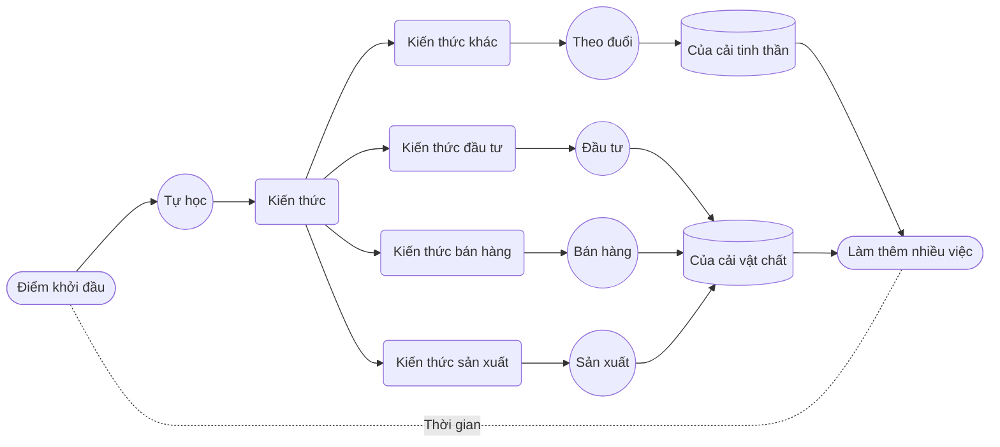

# 7. Tự khích lệ bản thân

Tự thúc đẩy bản thân rất tốt. Một khi động cơ được kích hoạt, chúng ta giống như chiếc ô tô đang chạy trên đường. Gặp ổ gà hay khúc cua, nó có thể phải giảm tốc độ; khi lên dốc cao, cần tăng sức mạnh; thậm chí có khi giữa đường “chết máy” phải khởi động lại... Tất cả những việc này đều cần do chính chúng ta làm, dù có thể nhờ đến sự giúp đỡ từ bên ngoài, nhưng tự mình làm vẫn hiệu quả hơn.

Trước hết, chúng ta cần liên tục củng cố động lực, để khi gặp những lúc **động cơ tắt bất ngờ** có thể dễ dàng **khởi động lại**.

Cách làm **tích cực** là chủ động mang lại nhiều **ý nghĩa sâu sắc hơn** cho mục tiêu, hành động và kết quả của mình ở mọi cấp độ. Cách làm **tiêu cực** là dựa vào **nỗi sợ hãi** — với bộ não, **nỗi sợ luôn là động lực mạnh nhất** — nó âm thầm tác động rất lớn ở tầng tiềm thức.

Chúng ta có thể làm một phép tính "giả định".

Trong cuốn _Sự thật về của cải_, tôi nói:

> Toàn bộ của cải trong cuộc đời ta, dù vật chất hay tinh thần, đều được "khai quật" từ chính **thời gian** của mình...

Vậy, **thời gian chính là tư liệu sản xuất**, dùng nó làm gì thì có lợi nhất?

Cuối cùng, xét đến xét lui, chỉ có **tự học**. Dù việc **luyện tiếng Anh** có vẻ không trực tiếp liên quan đến **sản xuất**, **bán hàng**, hay **đầu tư**, thì **học nó để làm gì?** — Trước hết không nói đến chuyện **kiếm tiền**, hãy nói về chuyện **tiết kiệm tiền**.

Xét về tỷ lệ, cha mẹ dành phần lớn tiền bạc cho con, đặc biệt là **cho việc học** — hiện tượng này khá phổ biến trên toàn cầu... Phần **lớn nhất** này, xét theo tỷ lệ, thường chiếm trên _60%_ thu nhập gia đình, thậm chí tới _80%_ cũng không hiếm.

Khi ta nói về việc **đầu tư tối thiểu 1000 giờ tập trung trong một năm** để **luyện tiếng Anh**, cốt lõi không chỉ là **tiếng Anh** — bởi thực chất bạn dùng cách này luyện bất kỳ ngôn ngữ hay kỹ năng nào cũng vậy — trong quá trình đó, bạn học nhiều hơn, luyện nhiều hơn, trải nghiệm sâu sắc hơn, thực tế là bạn đang rèn luyện **khả năng tự học**, là phát triển và hình thành **năng lực tự học**.

Nếu bạn là cha mẹ thực sự có năng lực tự học, thì dù con bạn chỉ tiếp thu qua môi trường xung quanh, chúng cũng sẽ có khả năng tự học tương đối mạnh hơn; hơn nữa, quá trình rèn luyện này có thể làm cùng nhau trong gia đình ngay từ đầu. Miễn sao trẻ có nền tảng năng lực tự học, phần lớn chi phí cha mẹ đầu tư cho con có thể tiết kiệm lại; không chỉ cha mẹ bớt tiền mà con trẻ cũng vì vậy mà trưởng thành nhanh hơn.

Một **tác dụng phụ** hoặc **phản ứng tiêu cực** khi cha mẹ cật lực kiếm tiền đầu tư cho con là con trẻ bị **giảm phát triển trí tuệ** — toàn bộ **kỹ năng** vốn chỉ có thể được hình thành trong quá trình **đối mặt và giải quyết vấn đề**, lại bị thay thế bằng việc cha mẹ kiếm tiền xử lý toàn bộ mọi rắc rối thay con. Những vấn đề con trẻ phải tự mình gặp, lẽ ra là cơ hội để chúng **lớn lên**, nay lại bị tước đoạt, đồng thời vấn đề thực sự chưa được giải quyết nhưng ta lại tưởng đã xong — sự thật rất dễ bị che giấu.

Vấn đề thực sự là con trẻ phải chịu trách nhiệm, đó đáng ra là cơ hội để nâng cao kỹ năng, nhưng cơ hội bị lấy đi còn vấn đề chưa được giải quyết, và ta tưởng đã xử lý xong. Từ đó vấn đề tích tụ lớn dần kèm theo vô số hiểu lầm, thậm chí ảo giác cũng lan rộng, cuối cùng kết quả là thất bại không thể cứu vãn — Đây không phải lời cảnh báo suông, hậu họa sẽ bộc lộ rõ lúc trẻ cỡ 15 tuổi, sẽ bùng phát dữ dội và không thể kiểm soát.

Hãy tính đơn giản. Giả sử vợ chồng bạn tổng thu nhập một năm là 300.000 NDT... Thời tiểu học, trung học cơ sở và trung học phổ thông, 12 năm, bình quân mỗi năm dành cho con khoản tiền khoảng 60%, tức 180.000 NDT. Trong đó khoảng 60% dành cho các lớp học thêm ngoài giờ — chi phí giáo dục cơ bản thực ra không cao, vì trên toàn thế giới trước khi tốt nghiệp trung học đa phần là **giáo dục bắt buộc** — Vậy khoản 108.000 tệ/năm, trong 12 năm là 1.296.000 tệ... Nếu con bạn có năng lực tự học thực sự tốt, chưa nói hết khoản chi này đều tiết kiệm được, ít nhất có thể tiết kiệm 80%, tức 1.036.800 tệ.

Còn khoản **đầu tư** của bạn? Chủ yếu không phải là **tiền**, cũng không chỉ là **thời gian**, mà là **sự tập trung chú ý**, là sự chú ý mà không cần đến chi phí tiền bạc. Ít nhất đầu tư 1000 giờ chú ý tập trung trong một năm — và chỉ một trong hai vợ chồng cũng được. Do vậy, về mặt tiền bạc gần như không mất gì, còn lợi ích thu về thì có thể là 1.036.800 tệ, và điều đặc biệt là bạn có thể đạt được trong vòng một năm — Đây là số tiền mà một cặp vợ chồng thu nhập 300.000 NDT cả ba năm trời không ăn không tiêu cũng không thể kiếm được! Dù làm công ăn lương hay kinh doanh, khoản lợi nhuận đầu tư thế này thật ngoài sức tưởng tượng! Không tính không biết, tính ra mới giật mình.

Cuối cùng, **lợi ích đầu tư** không dừng lại ở việc kiếm được hơn một triệu trong một năm. Bạn sẽ trở thành một **người song ngữ** — thậm chí tiếng Anh có thể trở thành ngôn ngữ mẹ đẻ mới của bạn. Bạn, con bạn, thậm chí cả người bạn đời đều sẽ **mở mang đầu óc**, trực tiếp chứng kiến sự thật và tác động tích cực của việc rèn luyện não bộ, bạn có được **năng lực tự học đích thực**; họ cũng âm thầm vượt qua ngưỡng cửa lớn nhất.

Nếu con bạn bị bạn ảnh hưởng — nếu bạn thực sự làm được, chúng chắc chắn sẽ chịu ảnh hưởng toàn diện — và sẽ trở thành người **đa ngôn ngữ**, ít nhất là **song ngữ**. Rất nhiều nghiên cứu chỉ ra rằng, **người đa ngôn ngữ** có khả năng suy nghĩ, học tập, giải quyết vấn đề, tổ chức và quản lý tốt hơn; thậm chí nguy cơ mắc bệnh Alzheimer cũng giảm nhiều. Về mặt cấu trúc não, vùng chất xám của họ có mật độ và kích thước lớn hơn, vùng chất trắng cũng trải rộng hơn.

Quan trọng hơn, nhiều khảo sát cho thấy, thu nhập của **người đa ngôn ngữ** cao hơn người đơn ngữ ít nhất _30%_ suốt đời... Hãy ước tính thu nhập trọn đời của con bạn, nhân thêm 30%, đó chính là khoản tiền bạn có thể giúp con "kiếm thêm" chỉ bằng việc đầu tư **ít nhất 1000 giờ tập trung trong một năm**... Nếu bạn sinh thêm vài người nữa, hãy thử tính tiếp?

Dùng tiền làm động lực luôn rất hiệu quả. Thật buồn cười, việc gọi là **dùng tiền làm động lực** thực ra chỉ là **làm phép tính giả định** mà thôi.

Không chỉ có tiền, còn rất nhiều thứ khác. Ví dụ, nỗ lực một năm của bạn chắc chắn đem lại sự **tôn trọng** mà tiền không mua được. Con người thì thế, cái gì mình không làm được mà người khác làm được thì chỉ có thể tôn trọng họ. Không kể người ngoài, được nửa kia tôn trọng rất quan trọng, vợ chồng sẽ thêm gắn bó; được con cái tôn trọng càng quan trọng, khi cha mẹ được **tôn trọng** bằng hành động, thì con cái không có chuyện **phản nghịch** — Tất cả những gì gọi là **phản nghịch** trên đời thực ra chỉ là biểu hiện của việc con cái không thấy cha mẹ đáng để tôn trọng, đúng không? **Nỗ lực một năm có thể đổi lấy sự tôn trọng trọn đời của con** — Xin hỏi, có đáng không?

Nếu bạn thực sự có kỹ năng nào đó có thể **dễ dàng vượt qua 90% mọi người** — bí quyết vô cùng đơn giản, đó là câu nói: **ít nhất 1000 giờ tập trung trong một năm** — toàn bộ khí chất của bạn sẽ thay đổi. Đầu tiên là biểu hiện qua cách người khác đối xử với bạn, rồi dần đến từ **sự tự tin** — điều quan trọng là, **tự tin** đó không thể là **tự phụ**, vì nó dựa trên thành tích thực tế. Khi không có thành tích, tự tin rất dễ trở thành trò cười; nhưng khi có năng lực trong tay, tự tin toát ra từ trong ra ngoài, tại sao không? Thậm chí bạn còn phải cố ý khiêm tốn — để người khác cảm thấy thoải mái hơn. Gương mặt điềm tĩnh, ánh mắt tập trung, dáng điệu thoải mái, thái độ ung dung, tất cả đều là biểu hiện tự nhiên, không thể giả vờ được. Cái nhìn từ bên ngoài ngày càng trở nên không quan trọng, xây dựng vỏ não là việc bạn thích nhất...

Hãy xem cách dùng **nỗi sợ** làm động lực nền tảng. Thực ra rất đơn giản:

> Hãy tìm mọi cách để tự thuyết phục rằng nếu không luyện tốt thì thà chết còn hơn...

Bộ não sợ chết nhất, miễn còn nguy cơ tử vong, nó sẽ không ngừng nâng cao **ngưỡng an toàn**, đến khi thoát khỏi mối đe dọa. Đó là cơ chế vận hành bộ não ta không thể thay đổi, thay vì bị hạn chế bởi nó, ta hãy biến nó thành lợi thế. Hãy điền câu: "**\_\_\_ Không luyện tốt thì chết!**" in ra và dán nơi bạn có thể nhìn thấy mỗi sáng khi mở mắt, hoặc in nhiều bản, hoặc làm hình nền điện thoại và đồng hồ... Thật buồn cười, bộ não rất dễ bị đánh lừa! Cứ lặp đi lặp lại nhiều là nó sẽ phải chọn tin tưởng.

Ngoài việc củng cố động lực liên tục, ta cần thỉnh thoảng **tự khích lệ** — không thể mãi trông chờ người khác khích lệ, đúng không? Cách tự khích lệ hiệu quả nhất có thể khiến nhiều người bất ngờ là **không ngần ngại khích lệ người khác** — rất đơn giản ấy mà.

Ai cũng cần khích lệ, nhưng khích lệ thì thường rất hiếm, nên bất cứ lúc nào mà bạn khích lệ người khác không ngừng đều là điều tốt cả, càng nhiều càng tốt. Bản chất khích lệ là thúc đẩy người được khích lệ hoàn thành những mục tiêu mà họ chưa tin hoặc không dám tin mình có thể làm được. Khi bạn khích lệ người khác một lần, trong lúc họ chưa làm được, họ vẫn còn nghi ngờ khả năng thành công — đó là lý do đa phần khích lệ không hiệu quả. Tuy nhiên, bạn khích lệ người khác đủ nhiều lần, bộ não bạn sẽ tin trước — Bạn biết đấy, người được hưởng lợi lớn nhất khi bạn khích lệ người khác lại chính là bạn!
