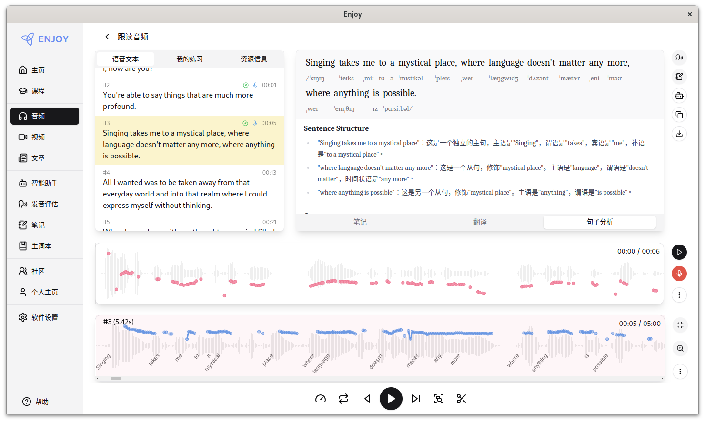
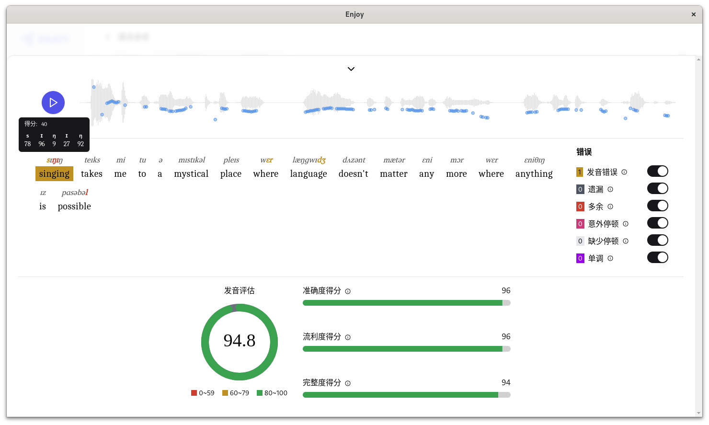
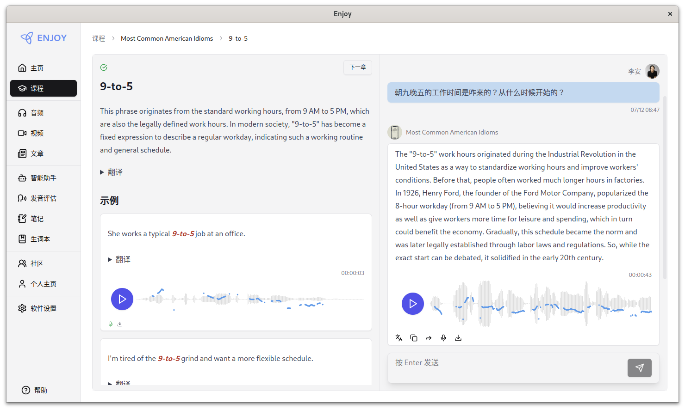
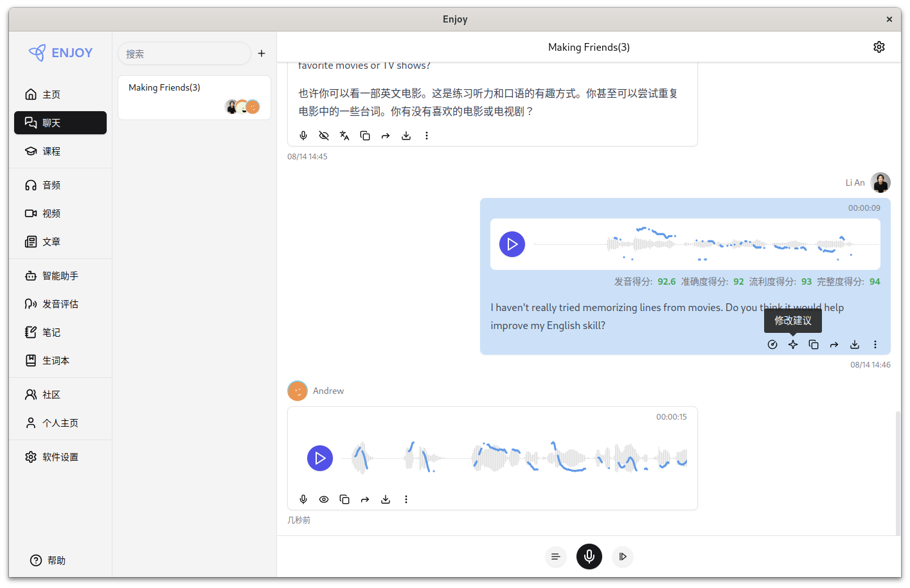

<div align="center">
  
</div>

<h3 align="center">
AI is the best foreign language teacher in the world today, and Enjoy is AI’s best teaching assistant.
</h3>

[](https://github.com/ZuodaoTech/everyone-can-use-english/actions/workflows/deploy-1000h.yml)
[](https://github.com/ZuodaoTech/everyone-can-use-english/actions/workflows/test-enjoy-app.yml)
[](https://github.com/ZuodaoTech/everyone-can-use-english/actions/workflows/release-enjoy-app.yml)


---

## Installation & Use

For download and usage instructions, please refer to [Documentation](https://1000h.org/enjoy-app/).

## Preview

<div align="center" style="display:flex;overflow:auto;">
  

  

  

  

  
</div>

## 开发

```bash
yarn install
yarn enjoy:start
```

## Related Reading

### One Thousand Hours (2024)

- [简要说明](https://1000h.org/intro.html)
- [训练任务](https://1000h.org/training-tasks/kick-off.html)
- [语音塑造](https://1000h.org/sounds-of-american-english/1-basics.html)
- [大脑内部](https://1000h.org/in-the-brain/01-inifinite.html)
- [自我训练](https://1000h.org/self-training/00-intro.html)

# Everyone can use English（2010）

## Directory

- [Brief introduction](./book/README.md)
- [Chapter 1: Starting point](./book/chapter1.md)
- [Chapter 2: Speaking](./book/chapter2.md)
- [Chapter 3: Voice](./book/chapter3.md)
- [Chapter 4: Reading aloud](./book/chapter4.md)
- [Chapter 5: Dictionary](./book/chapter5.md)
- [Chapter 6: Grammar](./book/chapter6.md)
- [Chapter 7: Intensive Reading](./book/chapter7.md)
- [Chapter 8: Advice](./book/chapter8.md)
- [Postscript](./book/end.md)

## Frequently Asked Questions

请查询 [文档 FAQ](https://1000h.org/enjoy-app/faq.html)。
